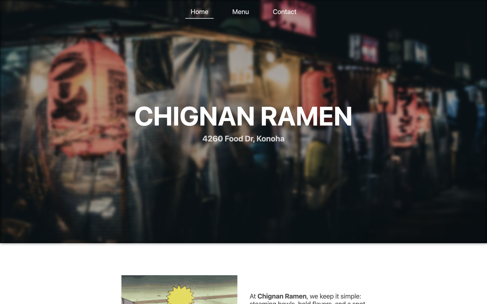

# restaurant-page

#### Check the live demo here -> https://amormio25.github.io/restaurant-page/

## Features 
- Modular code using ES6 modules with imports and exports for better organization
- Webpack configuration for bundling assets including CSS, images, and HTML templates
- Responsive design with dynamic pageloading, ensuring usability across devices

## Acknowledgements
- Project by The Odin Project
- Inspired by project submissions to The Odin Project